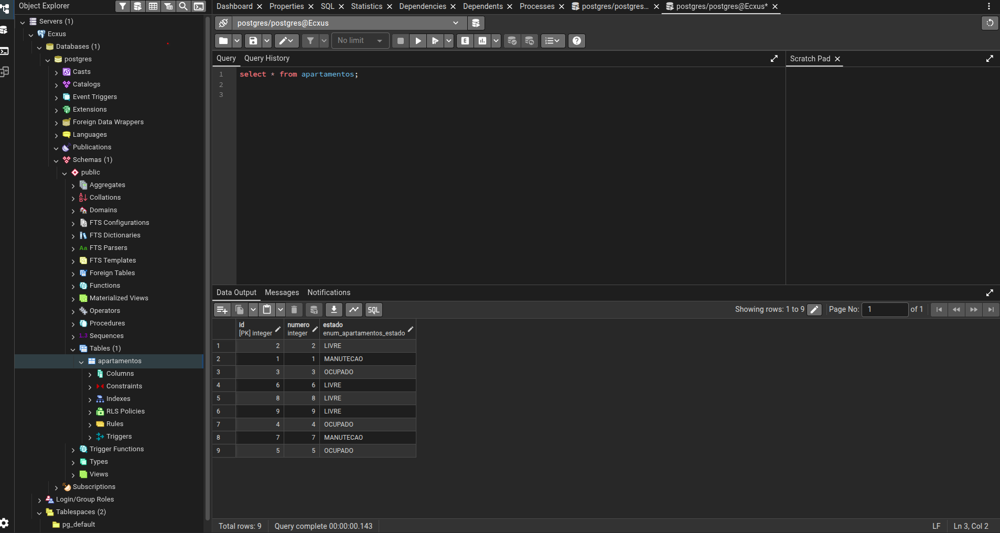
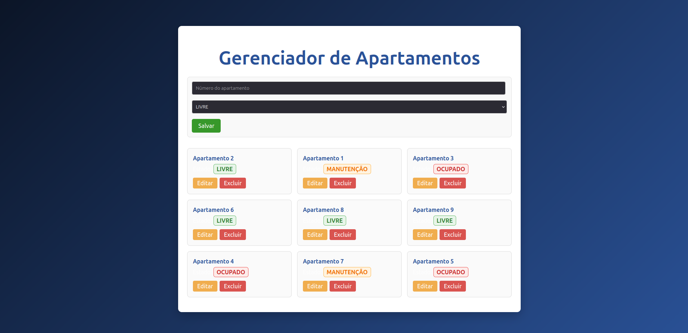
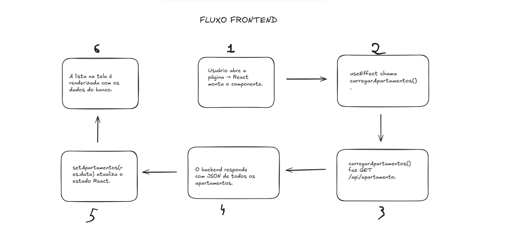

## Documentação do desafio Ecxus

#### Ferramentas:
 
* Javascript
* Nodejs | Sequelize
* Postgres
* React e Mui
* Testes E2E: Cypress 

## Backend

Backend foi dividido em 3 pastas: API, CONFIG E MODELS

- **API**  
  Contém as rotas da aplicação e as regras de negócio.  
  É onde ficam os endpoints da API, com os métodos GET, POST, PUT e DELETE, além das validações necessárias para cada requisição.

- **CONFIG**  
  Responsável pelas configurações do projeto, principalmente a conexão com o banco de dados PostgreSQL (host, porta, usuário, senha, etc).

- **MODELS**  
  Representa as tabelas do banco de dados.  
  Cada model define a estrutura da tabela, incluindo colunas, tipos de dados e relacionamentos.

### Requisições da API - Apartamento

| Método | Endpoint                                  | Descrição                              | Exemplo de Uso |
|------|--------------------------------------------|----------------------------------------|----------------|
| GET  | `/api/apartamento`                          | Lista todos os apartamentos             | `http http://localhost:3000/api/apartamento` |
| POST | `/api/apartamento`                          | Cadastra um novo apartamento            | `http POST http://localhost:3000/api/apartamento numero=101` |
| PUT  | `/api/apartamento/{id}`                     | Atualiza os dados de um apartamento     | `http PUT http://localhost:3000/api/apartamento/2 numero=102 estado=OCUPADO` |
| DELETE | `/api/apartamento/{id}`                   | Remove um apartamento pelo ID           | `http DELETE http://localhost:3000/api/apartamento/1` |

## Frontend

O frontend da aplicação foi desenvolvido em **React**, utilizando a biblioteca **Material UI (MUI)** para a construção da interface, garantindo um layout moderno, responsivo e consistente.

- A configuração principal da tela e a estrutura inicial da aplicação estão localizadas no arquivo:  
  **`/src/App.jsx`**

- A comunicação entre o frontend e o backend é feita utilizando a biblioteca **Axios**, responsável pelas requisições HTTP à API.

- As configurações do Axios e os métodos de acesso ao backend estão centralizados no arquivo:  
  **`/services/api.js`**

## Estrutura de Testes

- `cypress/e2e/apartamento.cy.js`  
  - Contém o fluxo completo do CRUD: adicionar, editar e excluir apartamentos.  
  - Limpa o formulário antes de cada teste.  
  - Verifica se os elementos existem e se as ações refletem na lista.  
